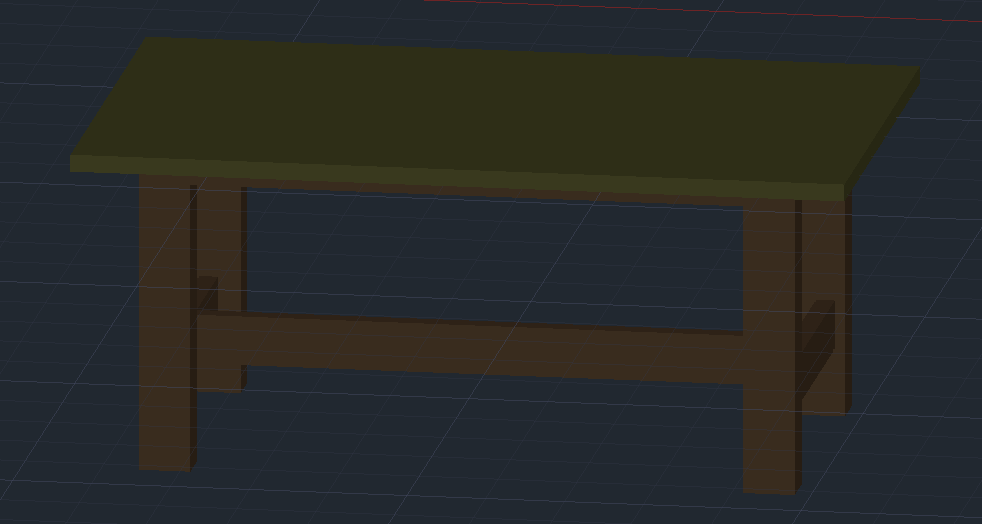
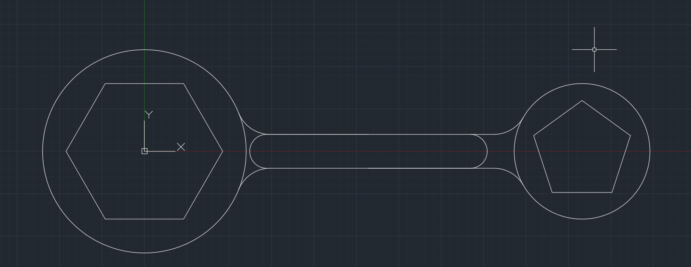
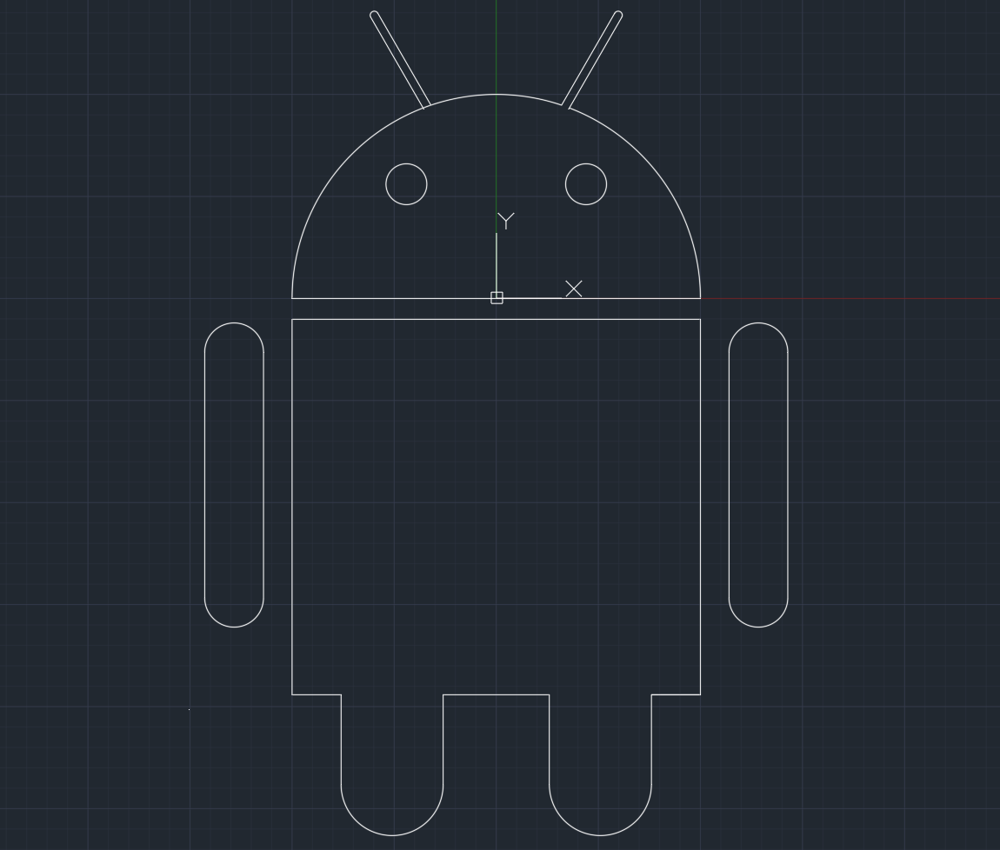

# 🏗️ AutoCAD Drawings – University Projects

## 📖 Project Overview
This repository contains a collection of **AutoCAD drawings** created during my undergraduate studies at the **Faculty of Mathematics and Computer Science – Ovidius University**.  
These works were part of various coursework and practical assignments where I explored technical design, precision modeling, and architectural drafting.

---

## 📂 Included Drawings
- **`table.dwg`** – 2D technical drawing of a table, focusing on precise dimensions and professional drafting techniques.
- **`1.dwg`** – Engineering/architectural sketch emphasizing geometric accuracy and layer management.
- **`2.dwg`** – Additional AutoCAD practice drawing showcasing use of blocks, hatching, and annotations.

---

## 🛠️ Tools & Skills
These drawings were developed using **AutoCAD** and demonstrate:
- ✅ Mastery of **2D drafting** and precise dimensioning  
- ✅ Use of **layers, blocks, and annotations**  
- ✅ Understanding of **technical standards** in CAD design  

---

## 🚀 How to Open
1. Download the `.dwg` files from this repository.  
2. Open them using:
   - **AutoCAD** (recommended)  
   - **Free alternatives** like [DWG TrueView](https://www.autodesk.com/products/dwg) or online viewers such as [Autodesk Viewer](https://viewer.autodesk.com/).

---

## ✨ Educational Context
These drawings were created as part of my **university coursework**, helping me develop a strong foundation in:
- Technical design principles  
- CAD software proficiency  
- Attention to detail and precision  

---

## 🖼️ Preview of the Drawings

| Table Drawing | Drawing 1 | Drawing 2 |
|---------------|-----------|-----------|
|  |  |  |

---

## 👩‍💻 Author
Created by **Andra Bogde**  
🎓 *Undergraduate Student at the Faculty of Mathematics and Computer Science, Ovidius University*  
🌱 *Currently pursuing a Master's in Cybersecurity & Machine Learning*

---

  💖 Proudly sharing my work and continuous learning journey

